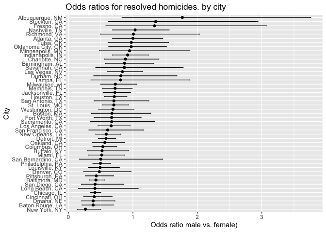

p8105_hw6_lah2231
================
Laura Henze
2024-12-02

# Problem 2

``` r
library(tidyverse)
```

    ## ── Attaching core tidyverse packages ──────────────────────── tidyverse 2.0.0 ──
    ## ✔ dplyr     1.1.4     ✔ readr     2.1.5
    ## ✔ forcats   1.0.0     ✔ stringr   1.5.1
    ## ✔ ggplot2   3.5.1     ✔ tibble    3.2.1
    ## ✔ lubridate 1.9.3     ✔ tidyr     1.3.1
    ## ✔ purrr     1.0.2     
    ## ── Conflicts ────────────────────────────────────────── tidyverse_conflicts() ──
    ## ✖ dplyr::filter() masks stats::filter()
    ## ✖ dplyr::lag()    masks stats::lag()
    ## ℹ Use the conflicted package (<http://conflicted.r-lib.org/>) to force all conflicts to become errors

``` r
homicide_data <- read.csv("data/homicide-data.csv")
#View(homicide_data)
```

``` r
head(homicide_data)
```

    ##          uid reported_date victim_last victim_first victim_race victim_age
    ## 1 Alb-000001      20100504      GARCIA         JUAN    Hispanic         78
    ## 2 Alb-000002      20100216     MONTOYA      CAMERON    Hispanic         17
    ## 3 Alb-000003      20100601 SATTERFIELD      VIVIANA       White         15
    ## 4 Alb-000004      20100101    MENDIOLA       CARLOS    Hispanic         32
    ## 5 Alb-000005      20100102        MULA       VIVIAN       White         72
    ## 6 Alb-000006      20100126        BOOK    GERALDINE       White         91
    ##   victim_sex        city state      lat       lon           disposition
    ## 1       Male Albuquerque    NM 35.09579 -106.5386 Closed without arrest
    ## 2       Male Albuquerque    NM 35.05681 -106.7153      Closed by arrest
    ## 3     Female Albuquerque    NM 35.08609 -106.6956 Closed without arrest
    ## 4       Male Albuquerque    NM 35.07849 -106.5561      Closed by arrest
    ## 5     Female Albuquerque    NM 35.13036 -106.5810 Closed without arrest
    ## 6     Female Albuquerque    NM 35.15111 -106.5378        Open/No arrest

## Preparing Data

``` r
prepared_homicide_data <- 
  homicide_data |>
  mutate(
    city_state = paste(city, state, sep = ", "),
    resolved = as.numeric(disposition == "Closed by arrest"),
    victim_age = as.numeric(victim_age)
  ) |>
  filter(
    !city_state %in% c("Dallas, TX", "Phoenix, AZ", "Kansas City, MO", "Tulsa, AL"),
    victim_race %in% c("White", "Black"),
    !is.na(victim_age)
  )
```

    ## Warning: There was 1 warning in `mutate()`.
    ## ℹ In argument: `victim_age = as.numeric(victim_age)`.
    ## Caused by warning:
    ## ! NAs introduced by coercion

``` r
#View(prepared_homicide_data)
```

I created city_state and resolved, converted victim_age to numeric,
omitted specific cities, and limited to White/Black races. I excluded
the lines without known ages.

## Logistic Regression for Baltimore

``` r
baltimore_data <- 
  prepared_homicide_data |> 
  filter(city_state == "Baltimore, MD")

baltimore_model <- 
  glm(
    resolved ~ victim_age + victim_sex + victim_race, 
    data = baltimore_data, 
    family = binomial()
  )

baltimore_results <- 
  broom::tidy(baltimore_model)

baltimore_sex_or <- 
  baltimore_results |> 
  filter(term == "victim_sexMale") |> 
  mutate(
    OR = exp(estimate), 
    CI_lower = exp(estimate - 1.96 * std.error), 
    CI_upper = exp(estimate + 1.96 * std.error)
  ) |> 
  select(term, OR, CI_lower, CI_upper)

baltimore_sex_or
```

    ## # A tibble: 1 × 4
    ##   term              OR CI_lower CI_upper
    ##   <chr>          <dbl>    <dbl>    <dbl>
    ## 1 victim_sexMale 0.426    0.325    0.558

For the Baltimore regression analysis I filtered for Baltimore, fit the
logistic regression using glm with resolved as the outcome and I
extracted odds ratio and confidence interval to cpmare male and female
victims. The results indicate that male victims are less likely to have
their homicides resolved compared to female victims with an odds ratio
of 0.4255 (95% CI: 0.3246–0.5579).

## Logistic Regression for each city

``` r
city_model_results <- 
  prepared_homicide_data |> 
  nest(data = -city_state) |> 
  mutate(
    model = map(data, \(df) glm(resolved ~ victim_age + victim_sex + victim_race, data = df, family = binomial())),
    results = map(model, broom::tidy)
  ) |> 
  select(city_state, results) |> 
  unnest(results) |> 
  filter(term == "victim_sexMale") |> 
  mutate(
    OR = exp(estimate),
    CI_lower = exp(estimate - 1.96 * std.error),
    CI_upper = exp(estimate + 1.96 * std.error)
  )

city_model_results
```

    ## # A tibble: 47 × 9
    ##    city_state      term     estimate std.error statistic  p.value    OR CI_lower
    ##    <chr>           <chr>       <dbl>     <dbl>     <dbl>    <dbl> <dbl>    <dbl>
    ##  1 Albuquerque, NM victim_…  5.70e-1     0.385  1.48     1.39e- 1 1.77     0.831
    ##  2 Atlanta, GA     victim_…  7.71e-5     0.194  0.000397 1.00e+ 0 1.00     0.684
    ##  3 Baltimore, MD   victim_… -8.54e-1     0.138 -6.18     6.26e-10 0.426    0.325
    ##  4 Baton Rouge, LA victim_… -9.64e-1     0.306 -3.15     1.65e- 3 0.381    0.209
    ##  5 Birmingham, AL  victim_… -1.39e-1     0.212 -0.657    5.11e- 1 0.870    0.574
    ##  6 Boston, MA      victim_… -3.95e-1     0.326 -1.21     2.26e- 1 0.674    0.356
    ##  7 Buffalo, NY     victim_… -6.53e-1     0.299 -2.18     2.90e- 2 0.521    0.290
    ##  8 Charlotte, NC   victim_… -1.23e-1     0.236 -0.524    6.00e- 1 0.884    0.557
    ##  9 Chicago, IL     victim_… -8.91e-1     0.102 -8.77     1.86e-18 0.410    0.336
    ## 10 Cincinnati, OH  victim_… -9.17e-1     0.269 -3.41     6.49e- 4 0.400    0.236
    ## # ℹ 37 more rows
    ## # ℹ 1 more variable: CI_upper <dbl>

``` r
#View(city_model_results)
```

I made the logistic regression for each city by grouping data by city,
fitting the logistic regression for each city and extracting odds ratio
and confidence interval for victim_sexMale.

## Plotting Odds Ratio and Confidence Interval for each city comparing male and female victims

``` r
city_model_results |> 
  ggplot(aes(x = reorder(city_state, OR), y = OR)) +
  geom_point() +
  geom_errorbar(aes(ymin = CI_lower, ymax = CI_upper), width = 0.2) +
  coord_flip() +
  labs(
    title = "Odds ratios for resolved homicides. by city",
    x = "City",
    y = "Odds ratio male vs. female)"
  )
```

<!-- -->

I plotted the adjusted odds ratio and confidence intervals for resolved
homicides in each city, comparing male and female victims. The
likelihood to resolve cases with male victims varies across cities, in
cities that have an OR of less than 1 male victims are less likely to
have their homicides resolved in comparison to female victims. The error
bars in the plot represent the uncertainty, the wider the more
uncertainty. The result and the plot indicate that male victims are less
likely to be resolved because most cities show odds ratios \< 1.
Albuquerque with the highest rate of resolved crimes for men with odds
ratio 1.77 (CI: 0.83–3.76) has a wide uncertainty, making this result
much less reliable.

# Problem 3

``` r
birthweight_data <- read.csv("data/birthweight.csv")
#View(birthweight_data)
```

## Converting numeric variables to labels where appropriate

``` r
birthweight_data <- birthweight_data |>
  mutate(
    babysex = factor(babysex, levels = c(1, 2), labels = c("Male", "Female")),
    frace = factor(frace, levels = c(1, 2, 3, 4, 8, 9), labels = c("White", "Black", "Asian", "Puerto Rican", "Other", "Unknown")),
    mrace = factor(mrace, levels = c(1, 2, 3, 4, 8), labels = c("White", "Black", "Asian", "Puerto Rican", "Other")),
    malform = factor(malform, levels = c(0, 1), labels = c("Absent", "Present"))
  )
```

## Checking for missing values

``` r
missing_values <- colSums(is.na(birthweight_data))
missing_values
```

    ##  babysex    bhead  blength      bwt    delwt  fincome    frace  gaweeks 
    ##        0        0        0        0        0        0        0        0 
    ##  malform menarche  mheight   momage    mrace   parity  pnumlbw  pnumsga 
    ##        0        0        0        0        0        0        0        0 
    ##    ppbmi     ppwt   smoken   wtgain 
    ##        0        0        0        0

## Summarizing dataset

``` r
summary(birthweight_data)
```

    ##    babysex         bhead          blength           bwt           delwt      
    ##  Male  :2230   Min.   :21.00   Min.   :20.00   Min.   : 595   Min.   : 86.0  
    ##  Female:2112   1st Qu.:33.00   1st Qu.:48.00   1st Qu.:2807   1st Qu.:131.0  
    ##                Median :34.00   Median :50.00   Median :3132   Median :143.0  
    ##                Mean   :33.65   Mean   :49.75   Mean   :3114   Mean   :145.6  
    ##                3rd Qu.:35.00   3rd Qu.:51.00   3rd Qu.:3459   3rd Qu.:157.0  
    ##                Max.   :41.00   Max.   :63.00   Max.   :4791   Max.   :334.0  
    ##     fincome               frace         gaweeks         malform    
    ##  Min.   : 0.00   White       :2123   Min.   :17.70   Absent :4327  
    ##  1st Qu.:25.00   Black       :1911   1st Qu.:38.30   Present:  15  
    ##  Median :35.00   Asian       :  46   Median :39.90                 
    ##  Mean   :44.11   Puerto Rican: 248   Mean   :39.43                 
    ##  3rd Qu.:65.00   Other       :  14   3rd Qu.:41.10                 
    ##  Max.   :96.00   Unknown     :   0   Max.   :51.30                 
    ##     menarche        mheight          momage              mrace     
    ##  Min.   : 0.00   Min.   :48.00   Min.   :12.0   White       :2147  
    ##  1st Qu.:12.00   1st Qu.:62.00   1st Qu.:18.0   Black       :1909  
    ##  Median :12.00   Median :63.00   Median :20.0   Asian       :  43  
    ##  Mean   :12.51   Mean   :63.49   Mean   :20.3   Puerto Rican: 243  
    ##  3rd Qu.:13.00   3rd Qu.:65.00   3rd Qu.:22.0   Other       :   0  
    ##  Max.   :19.00   Max.   :77.00   Max.   :44.0                      
    ##      parity            pnumlbw     pnumsga      ppbmi            ppwt      
    ##  Min.   :0.000000   Min.   :0   Min.   :0   Min.   :13.07   Min.   : 70.0  
    ##  1st Qu.:0.000000   1st Qu.:0   1st Qu.:0   1st Qu.:19.53   1st Qu.:110.0  
    ##  Median :0.000000   Median :0   Median :0   Median :21.03   Median :120.0  
    ##  Mean   :0.002303   Mean   :0   Mean   :0   Mean   :21.57   Mean   :123.5  
    ##  3rd Qu.:0.000000   3rd Qu.:0   3rd Qu.:0   3rd Qu.:22.91   3rd Qu.:134.0  
    ##  Max.   :6.000000   Max.   :0   Max.   :0   Max.   :46.10   Max.   :287.0  
    ##      smoken           wtgain      
    ##  Min.   : 0.000   Min.   :-46.00  
    ##  1st Qu.: 0.000   1st Qu.: 15.00  
    ##  Median : 0.000   Median : 22.00  
    ##  Mean   : 4.145   Mean   : 22.08  
    ##  3rd Qu.: 5.000   3rd Qu.: 28.00  
    ##  Max.   :60.000   Max.   : 89.00
